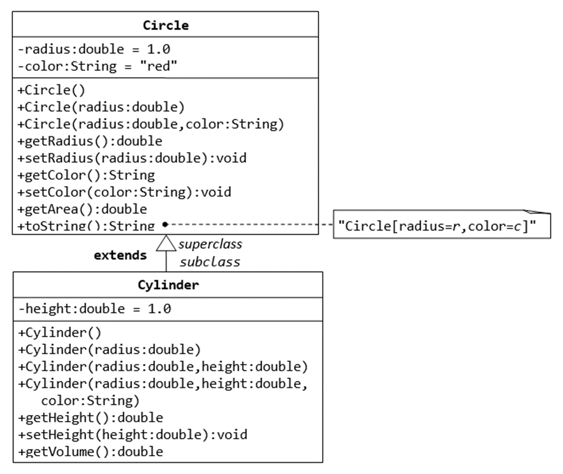

# Задание

* Нужно реализовать 4 типа фигур (квадрат, треугольник, круг, эллипс )
* Интерфейс который должна реализовывать фигура [Shape.java](Shape.java)
* имплементация класса с main функцией, который создает 4 Shape разного типа,
  и на консоль вывести площади всех фигур + тип фигуры
* на каждый класс написать тесты getArea(),
  тестов должно быть больше чем один, зависит от параметров класса

Пример UML диаграммы (цилиндр и круг)

