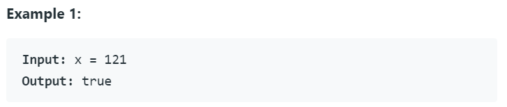
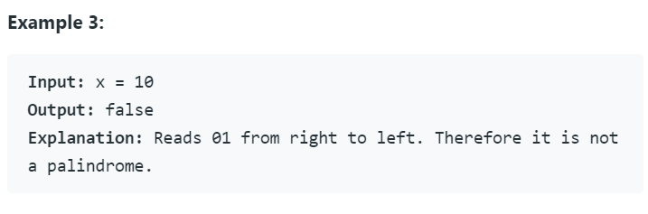

# Задание

* Нужно реализовать класс, который проверяет, является ли входное число палиндромом
  https://ru.wikipedia.org/wiki/%D0%9F%D0%B0%D0%BB%D0%B8%D0%BD%D0%B4%D1%80%D0%BE%D0%BC
  В случае отрицательного значения "-" должен быть откинут
  
* Класс должен реализовывать интерфейс[Palindrome](Palindrome.java)
  
* Необходимо написать 3 теста для проверки
  
* оригинальный текст [задачи](https://leetcode.com/problems/palindrome-number/)

